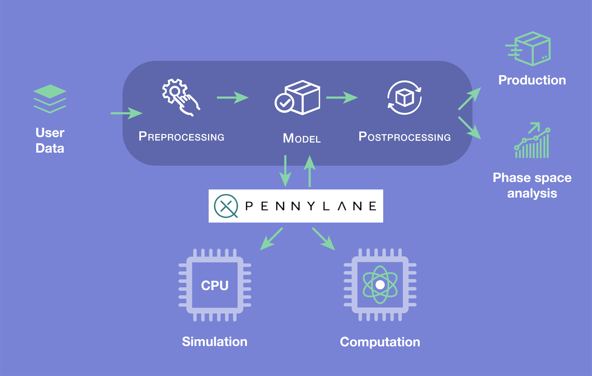

===============================================
Automating Quantum Neural Networks Applications
===============================================

|

.. image:: https://readthedocs.org/projects/prevision-quantum-nn/badge/?version=latest
  :target: https://prevision-quantum-nn.readthedocs.io/en/latest/?badge=latest
  :alt: Documentation Status

.. image:: https://img.shields.io/github/license/previsionio/prevision-quantum
  :alt: GitHub license
  :target: https://github.com/previsionio/prevision-quantum/blob/master/LICENSE

Prevision-quantum-nn is a library that allows to handle automatically quantum variational circuits.
It is developed by `prevision.io <https://prevision.io/>`_.

It is built over `pennylane <https://pennylane.ai/>`_, developped by `Xanadu <https://www.xanadu.ai/>`_.

For further information on the usage of the library, refer to the `documentation <https://prevision-quantum-nn.readthedocs.io/en/latest/index.html#>`_.

Personal notes: Unfortunately, I suspect Prevision.io to have run out of business, as their website yields an error 404... 
This fork corresponds to the branch I developed during my internship there. We didn't have time to do a pull request.
